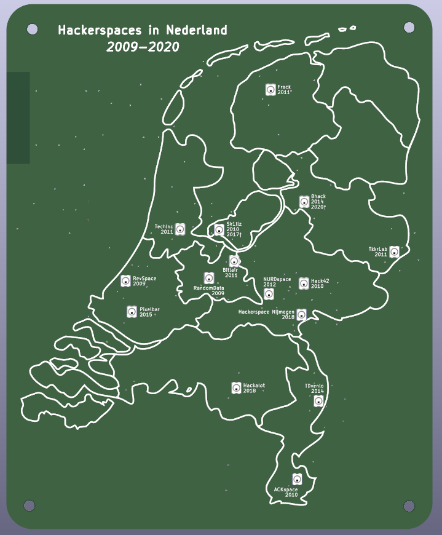
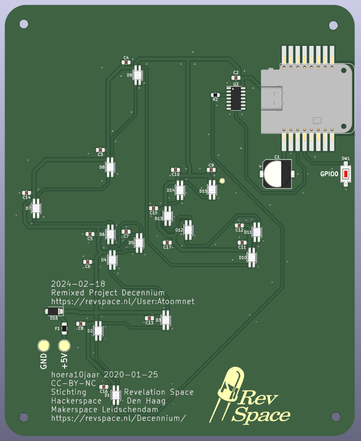

# Status

Untested. Do not replicate.

# Build

Order missing components.

Order PCB. You may want to check the option remove the order number from the PCB.

For the `Wemos D1 mini usb-c` you need 2 pieces of 1x08 right angle 2.54mm pin header.

Solder the PCB.

# Firmware

https://github.com/atoomnetmarc/Project-Decennium-Firmware

# Pics

