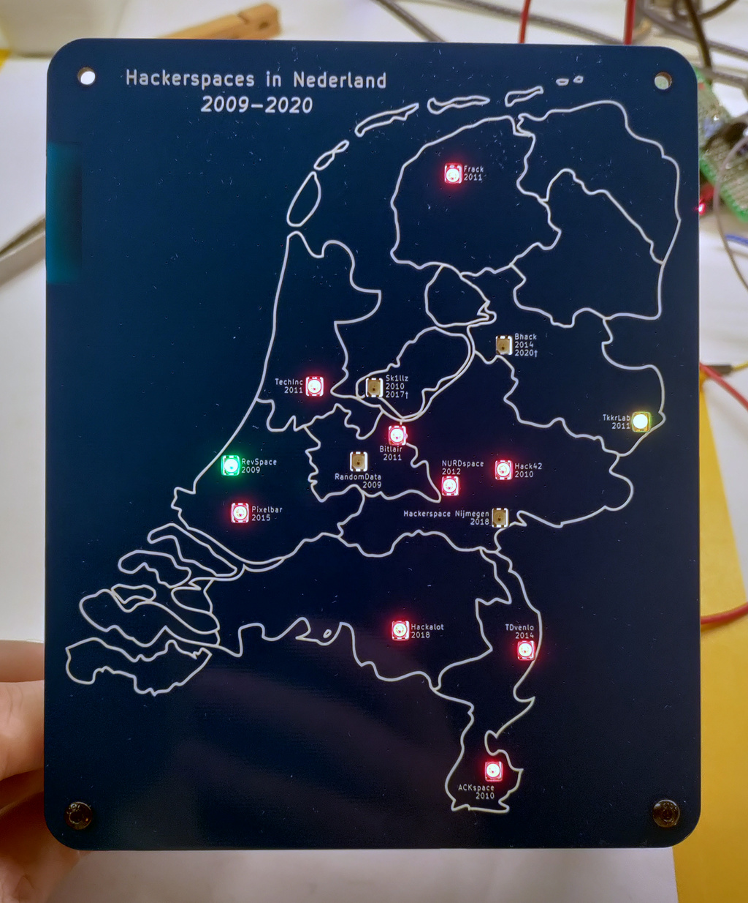
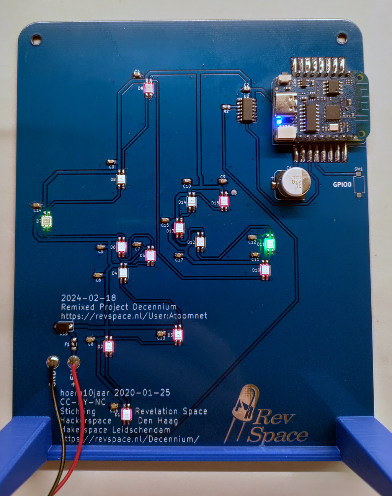

# Status

Assembled and working.

# Build

Order components mentioned on the [BOM](Kicad/bom/ibom.html). For the `Wemos D1 mini usb-c` (U1) you need 2 pieces of 1x08 right angle 2.54mm pin header.

Order PCB. You may want to check the option remove the order number from the front of the PCB.

Solder the PCB.

# Firmware

Flash the firmware: https://github.com/atoomnetmarc/Project-Decennium-Firmware

# 3d-print

3d-print a [stand](3d-print/Project-Decennium%20PCB%20stand.stl). Orient the print for printing like [this](3d-print/Project-Decennium%20PCB%20stand%20-%20print%20orientation%20example.png).

Use 2 M3x12 BHCS screws to screw the stand to the pcb.

# Pics

